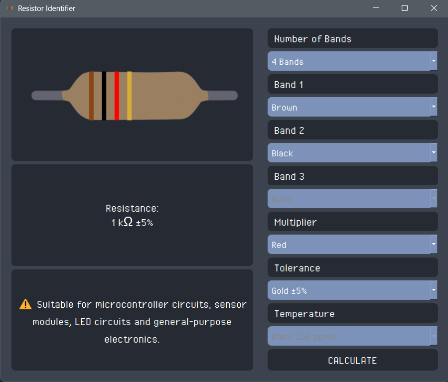
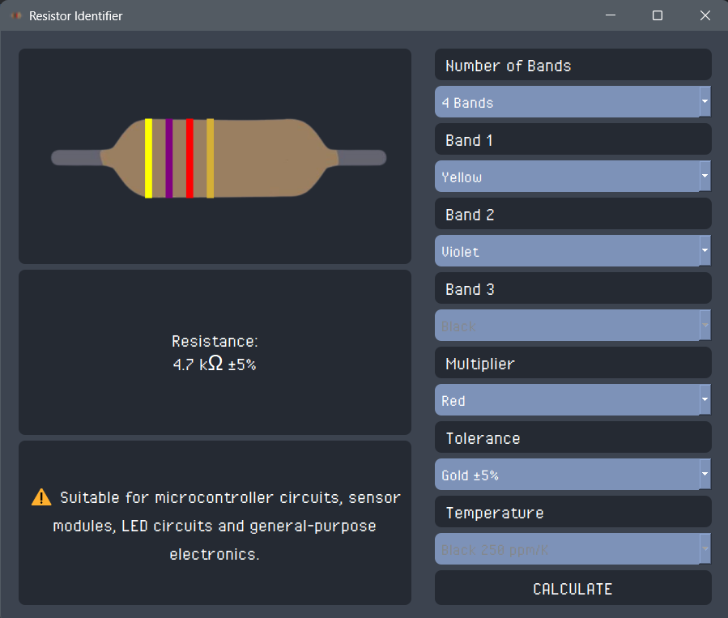

# ⭐ Resistor Identifier

<p align="center">
  
</p>

<p align="center">
  A desktop application built with **Python and PyQt5** for identifying resistor values from their color bands!
</p>

The application allows users to select the number of resistor bands and their colors, then automatically calculates the resistance value, tolerance, resistance range, and common applications.


## ✨ Features

* Select resistor colors using color-coded combo boxes
* Support for **3, 4, 5, and 6-band resistors**
* Automatic resistance calculation
* Automatic resistance range calculation based on tolerance
* Temperature coefficient support for 6-band resistors
* Application suggestions based on resistance value
* Dynamic resistor visualization
* Automatic unit formatting:
  * Ω
  * kΩ
  * MΩ


## ❓ How It Works

The application follows the standard resistor color code. For example:

**Yellow – Violet – Red – Gold**

```text
Yellow = 4
Violet = 7
Red = ×100
Gold = ±5%

47 × 100 = 4700 Ω

4700 Ω = 4.7 kΩ
```

The result is:

```text
4.7 kΩ ±5%
```

The application also calculates the possible resistance range:

```text
Minimum = 4.7 kΩ × 0.95 = 4.465 kΩ
Maximum = 4.7 kΩ × 1.05 = 4.935 kΩ
```

<p align="center">
  
</p>


## ✨ Supported Resistor Types

| Bands | Configuration                                               |
| ----: | ----------------------------------------------------------- |
|     3 | 2 digits + multiplier                                       |
|     4 | 2 digits + multiplier + tolerance                           |
|     5 | 3 digits + multiplier + tolerance                           |
|     6 | 3 digits + multiplier + tolerance + temperature coefficient |

### Temperature Coefficient

6-band resistors additionally support temperature coefficients such as:

* 250 ppm/K
* 100 ppm/K
* 50 ppm/K
* 15 ppm/K
* 25 ppm/K
* 20 ppm/K
* 10 ppm/K
* 5 ppm/K
* 1 ppm/K

## ✨ Application Information

The application provides a short description of common uses based on the calculated resistance value.

Examples include:

* Current sensing and shunt applications
* LED current limiting
* Transistor biasing
* Arduino and ESP32 circuits
* Sensor modules
* Pull-up and pull-down circuits
* Signal circuits
* Voltage sensing

> These suggestions are general guidelines. The actual suitability of a resistor also depends on factors such as voltage, current, power rating, and the rest of the circuit.

## 🛠️ Technologies

* **Python**
* **PyQt5**
* **Qt Designer / Qt Widgets**
* **QPainter**
* **QPixmap**


## ✨ Author & License

**PaniBitLab**

This project is open-source and available for learning and educational purposes however; If you use this project or its ideas in your own work, please consider mentioning this repository and giving it a star. :)
